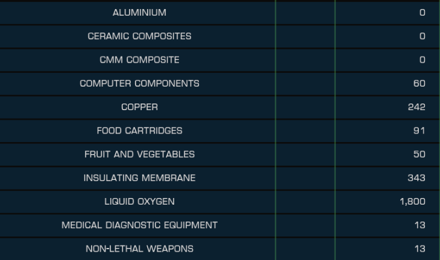
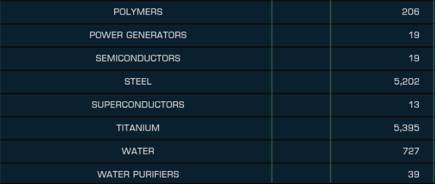

#  Elite Dangerous Colony Construction Tracker
<div align="center">
  
</div>

This project is a tool designed to help track and manage the construction of colonies in Elite Dangerous. It provides an organized way to monitor progress, resources, and tasks.

## Features

- Track construction progress for a given Elite Dangerous Trailblazers Colonization Project.
- Provides (roughly) realtime delivery tracking.
- User-friendly interface for easy viewing.
- Processes screenshots taken from Elite to populate the commodities, and how many of them are required.

## Usage

1. Download one of the [Releases](/releases/tag/Releases), or clone the repository and run or build from source.
2. The program is mostly automated, all you have to do is grab screenshots from your Colonisation Ship's transfer UI and drag and drop them onto the Colony Construction Tracker.
3. These screenshots will be parsed for their information, and the table populated. Please see the in-app guidance for what screenshots you need to get, or see the included ones after these instructions!
4. Deliveries will be tracked over time while the program is open. Reading from the filesystem isn't instant, so give it a few seconds to recognize any deliveries you might make.
5. Enjoy knowing what commodities you still have left to aquire for your colonization project, and watch line go up as the progress bar fills with successful deliveries!




## Installation

1. Clone the repository:
  ```bash
  git clone https://github.com/tcgm/EDColonyConstructionTracker.git
  ```
2. Navigate to the project directory:
  ```bash
  cd ed-colony-construction-tracker/
  ```
3. Install dependencies:
  ```bash
  npm install
  ```

## Usage

1. Start the application:
  ```bash
  npm start
  ```
2. Electron will open.

## Contributing

Contributions are welcome! Please follow these steps:

1. Fork the repository.
2. Create a new branch:
  ```bash
  git checkout -b feature-name
  ```
3. Commit your changes:
  ```bash
  git commit -m "Add feature-name"
  ```
4. Push to the branch:
  ```bash
  git push origin feature-name
  ```
5. Open a pull request.

## License

This project is licensed under the [MIT License](LICENSE).

## Acknowledgments

- Thanks to the open-source community for their support.
- Inspired by the sanity needs of Elite Dangerous colony builders.
- Roughly inspired by a Python attempt at this, located here: https://github.com/djglass/ed-colony-construction-tracker
